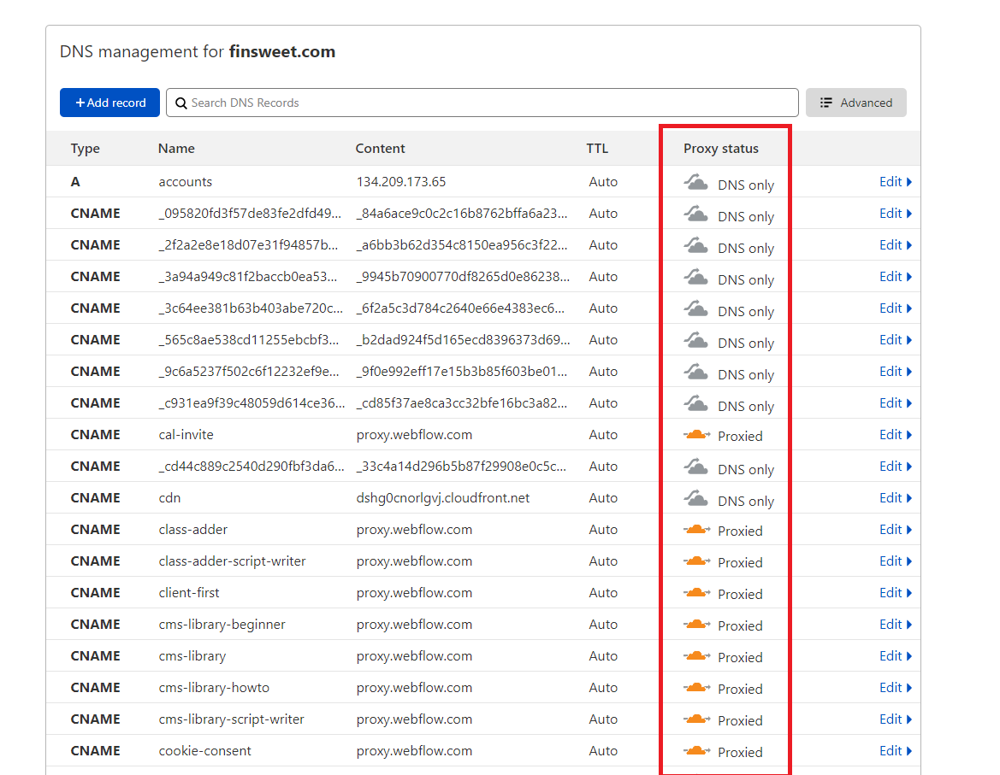
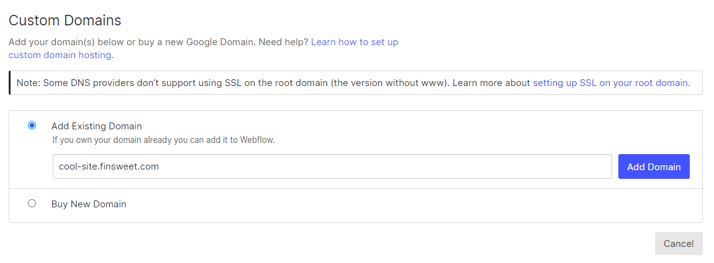
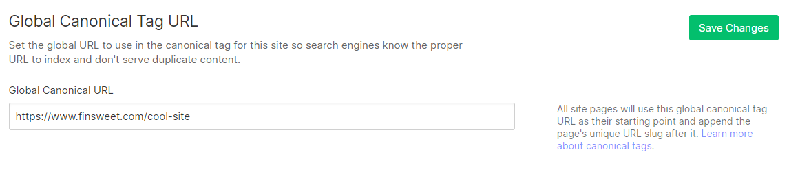
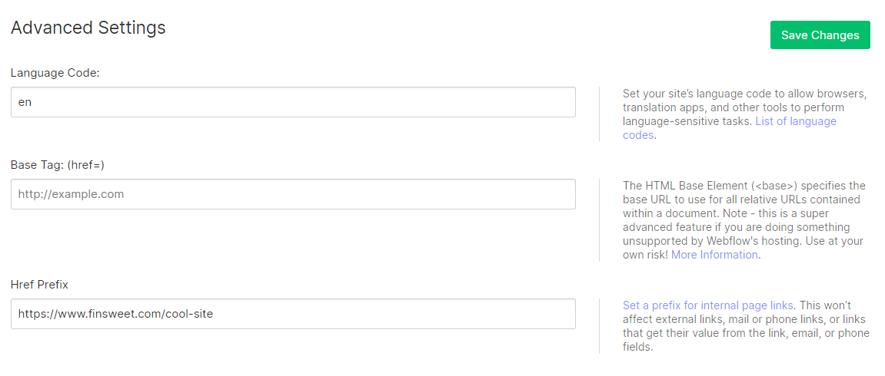
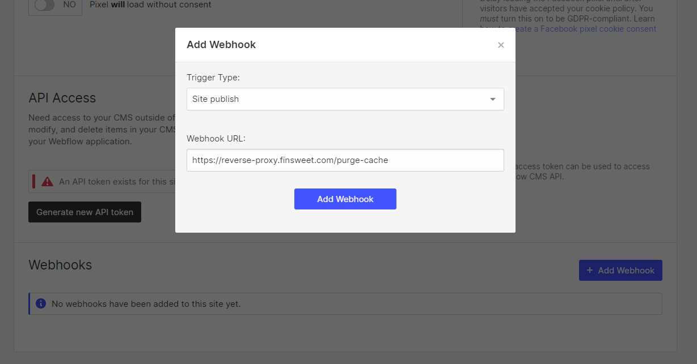
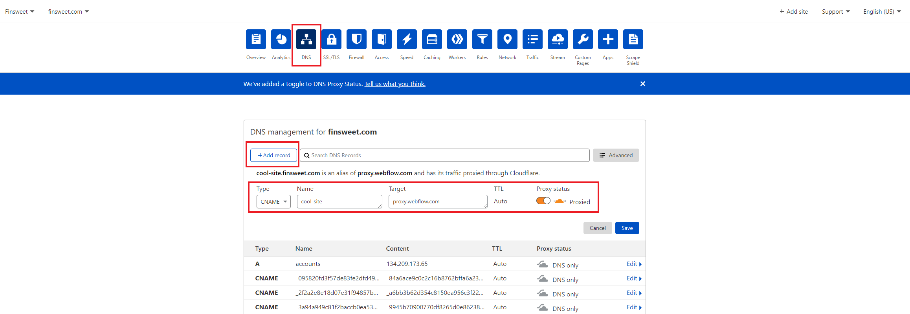
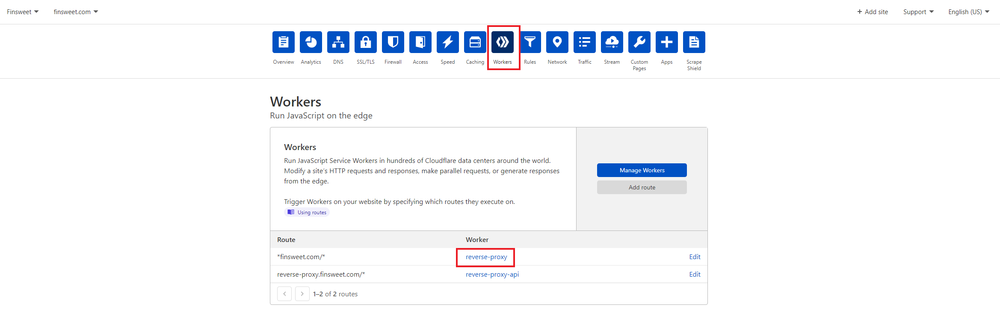
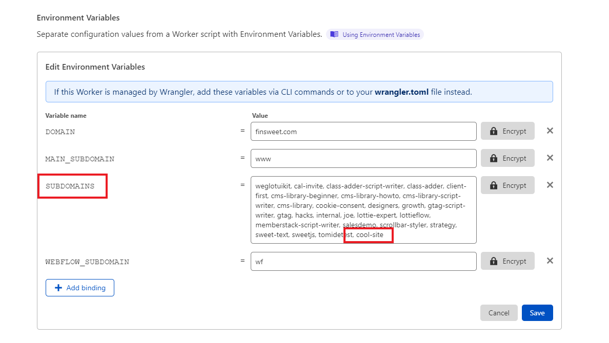

# Finsweet's Reverse Proxy

This repository contains the Cloudflare Worker script for reverse proxying all the Finsweet subdomains under the main `finsweet.com` domain, as well as documentation on how to properly manage them.

Contents:

1. [DNS Management](#dns-management).

   1. [Difference between Proxied / Unproxied DNS](#difference-between-proxied--unproxied-dns).
   2. [Why are the Webflow sites poiting to proxy.webflow.com instead of proxy-ssl.webflow.com?](#why-are-the-webflow-sites-poiting-to-proxywebflowcom-instead-of-proxy-sslwebflowcom)

2. [Setting up a new Webflow site](#setting-up-a-new-webflow-site)

3. [FAQ](#faq)

## DNS Management

The DNS of the `finsweet.com` domain are managed from Cloudflare. You can access it by asking @alexiglesias to include you as a team member of the Cloudflare account.

In there, you will notice that some DNS records are set to be proxied, and some not. Continue reading to know the differences between them.



### Difference between Proxied / Unproxied DNS

The main difference resides wether Cloudflare will intercept any request to the destination before it reaches it.

As a rule of thumb, only the reverse-proxied subdomains need to be proxied to intercept any request to them before it reaches Webflow's servers.

Any DNS that is set to point a non-Webflow destination, like `cdn.finsweet.com` should be set to `DNS only`.

### Why are the Webflow sites poiting to proxy.webflow.com instead of proxy-ssl.webflow.com?

There are two reasons for this:

1.  How Webflow generates the SSL certificate to all the binded domains.
2.  The requirements for an SSL Handshake to be valid.

#### How Webflow generates the SSL certificate to all the binded domains

When pointing a DNS record to `proxy-ssl.webflow.com`, Webflow automatically creates an SSL certificate that is valid for 3 months, and auto-renews it when this period is coming to an end.

The problem comes when we proxy this DNS record, as it is no longer pointed directly to Webflow's servers, and instead it goes through Cloudflare first. This causes [Webflow not being able to generate a valid SSL certificate](https://forum.webflow.com/t/error-525-ssl-handshake-failed/73756/2).

The only solution to this problem is uploading custom SSL certificates to Webflow, which is currently something that is only offered to [Enterprise customers](https://university.webflow.com/lesson/ssl-hosting#upload-a-custom-ssl-certificate).

#### The requirements for an SSL Handshake to be valid

An SSL Handshake requires both parties (Cloudflare and Webflow) to share an SSL certificate to determine that a connection is secure.

As this is not possible, we need to point the connection to the plain `proxy.webflow.com` origin and rely on [Cloudflare's Flexible mode](https://support.cloudflare.com/hc/en-us/articles/200170416-End-to-end-HTTPS-with-Cloudflare-Part-3-SSL-options#h_4e0d1a7c-eb71-4204-9e22-9d3ef9ef7fef) to encrypt the connection between the browser and Cloudflare.

## Setting up a new Webflow site

The process is split in the following steps:

1. Correctly configuring the Webflow project.
2. Creating the subdomain's DNS record.
3. Adding the to-be-proxied subdomain to the Cloudflare Worker environment.

### Correctly configuring the Webflow project

#### Hosting Tab

In the **Hosting** tab, set up the project domain as `SUBDOMAIN_NAME.finsweet.com`. After the setup is done correctly, all the traffic will be served under `finsweet.com/SUBDOMAIN_NAME/`.



#### SEO Tab

In the **SEO** tab, add `https://www.finsweet.com/SUBDOMAIN_NAME` as the **Global Canonical Tag URL** (note the `https://www.` in front of the domain, this is mandatory).
This will make sure Google doesn't consider any content outside of the `www.finsweet.com` main domain to be duplicated.



#### Custom Code Tab

In the **Custom Code** tab, add the same `https://www.finsweet.com/SUBDOMAIN_NAME` URL as the **Href Prefix**.
This will assure that all relative URLs accross the project point correctly to the reverse-proxied path instead of the original subdomain.



#### [Optional] Purge Cache on publish

By default, Cloudflare adds a 4h cache to all the assets that are being reverse-proxied. This means that if you publish any changes to the Webflow project (the `.webflow.io` staging domain is not cached, only the live `SUBDOMAIN_NAME.finsweet.com` version), it can take up to 4h for users to see the new changes.

To prevent this, there's the option of immediately purging the cache whenever a Finsweet site is published.

To do so, move to the **Integrations** tab and create a **Site Publish** Webhook with the following URL:

```
https://reverse-proxy.finsweet.com/purge-cache
```



### Creating the subdomain's DNS record

Easy step, you just need to move to the **DNS** tab in Cloudflare and click to `+ Add record`.

Enter the following settings:

- Type: `CNAME`.
- Name: The `SUBDOMAIN_NAME`.
- Target: `proxy.webflow.com`.
- TTL: Auto.
- Proxy status: Proxied.

And Save it.



### Adding the to-be-proxied subdomain to the Cloudflare Worker environment

Last step, move to the **Workers** tab in Cloudflare and click on the `reverse-proxy` worker.



In it, locate the **Settings** tab and click on `Edit variables`.


In there, you will notice a `SUBDOMAINS` variable that contains a comma-separated list of all the reverse-proxied subdomains. Add here the new subdomain, making sure that:

- The subdomain it's not repeated (it doesn't exist already in the list).
- You use a comma `,` to separate each subdomain. The white spaces don't matter and have no effect.



Hit on **Save**, and you're done! Don't forget to test it out 💪.

## FAQ

### Why can't we reverse-proxy e-commerce sites?

Webflow keeps track of the user's actions in e-commerce sites with cookies and [CSRF tokens](https://portswigger.net/web-security/csrf/tokens) to prevent any sort of malicious behaviors.

Every time that an action is performed by the user (Adding an product to the cart, calculating the checkout value, filling the payment form, etc), Webflow makes a request to their servers and validates it. The problem comes when Webflow detects that the page where the user is acting is not the one that it's supposed to be (`www.finsweet.com/SUBDOMAIN` instead of `SUBDOMAIN.finsweet.com`) and blocks the action.

### I've published some changes but they don't reflect on the live domain

This is probably caused by Cloudflare's caching, read [Purge cache on publish](#optional-purge-cache-on-publish) to learn how to bypass it.

### I've set up a redirect in the Webflow project but it's not working

All redirects to external sites (Example: from `/page-path` to `https://www.google.com`) work correctly as of the day of writing this article.

On the other hand, redirects under the same domain (Example: from `/page-path-1` to `/page-path-2`) will cause the content to be served on both paths. This is something that will be fixed soon.

In the meantime, you don't have to worry about the SEO impact on it, as the [Global Canonical Tag URL](#seo-tab) makes sure that the crwaling bots don't consider it as duplicated content.

### I can't access Cloudflare

Contact @alexiglesias and he will invite you to join the team.
